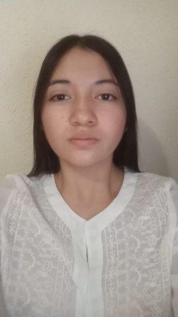
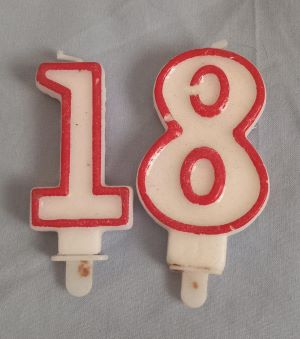
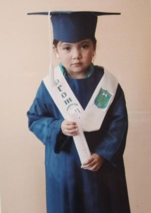
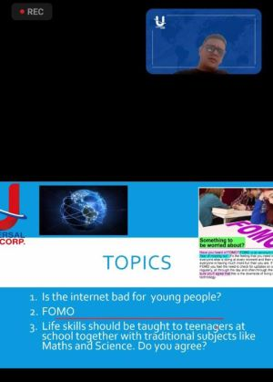
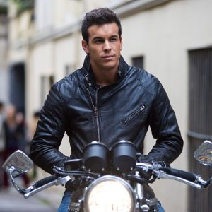
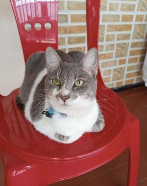
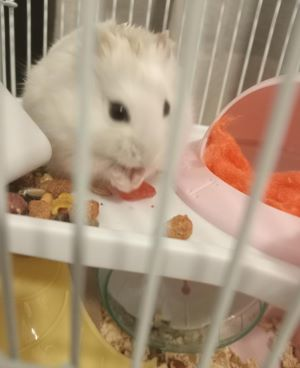
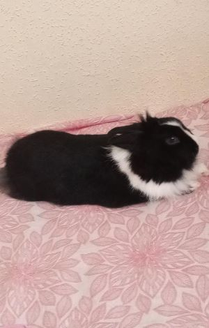

# Sobre mí
### Nombre
Me llamo Yudy **Vanessa** Pinzón Sanabria
#### 
### Edad
Tengo 18 años y cumplo el 9 de abril del año 2006
#### 
### País y Ciudad de Nacimiento
Yo nací en **Colombia** pero mi ciudad fue *Tunja*, es la capital del departamento de ***Boyacá***,
siendo la capital más alta del país, además de eso su clima suele ser frío pero lo suficiente,
sin embargo, me fui a un clima cálido a mis 14 años casi 15 en una ciudad llamada
Villavicencio la cual hace parte del llano de mi país.
#### 
### Educación
Hice mi primaria en un colegio llamado Sagrado Corazón de Jesús, luego la Secundaria en
el Liceo León De Greiff los dos ubicados en Tunja, luego de esto hice el bachiller y un
Técnico en Asistencia Administrativa en el instituto Gilberto Álzate Avendaño en otra ciudad
llamada Villavicencio, después hice el primer semestre de Turismo en la Uco Córdoba pero
me salí porque no me gustó como tal y no me veía trabajando de eso, por lo que me metí a
Administración de sistemas informáticos en Red (ASIR) en el actual instituto C.E.S Ramón
y Cajal, ya que me llamaba la atención.
#### 
### Experiencia laboral
Como tal tengo muy poca experiencia, sin embargo, por el Técnico en Asistencia
Administrativa hice prácticas 6 meses en la Fiscalía Nacional de mi país Colombia.
#### 
### Habilidades
1. **Liderazgo**: Me gusta siempre ser la líder en algunos proyectos y hacer que salgan de la
mejor manera posible.
2. **Comunicación**: Cuando tengo que transmitir algo intento que sea algo claro y entendible
para que no haya confusiones.
3. **Edición de videos**: Solía editar muchos videos y es algo q me gusta y se me da bien de
cierto modo.
4. **Gestión del tiempo**: Suelo organizarme de una manera eficiente para poder hacer todo lo
que necesito.
5. **Planificar proyectos**: Me gusta organizar algunos proyectos y llevarlos hasta su finalidad.
#### 
6. **Idiomas**: En esto solo tengo el español que es nativo y el inglés B1 Certificado.
#### 
7. **Escritura Creativa**: Me gusta escribir cuentos, además de poemas y canciones.
8. **Cocina**: Me gusta y sigo intentando practicar la repostería ya que me llama la atención.
9. **Deportes**: Solía practicar baloncesto, patinaje, fútbol, volleyball y atletismo aunque
también hice un poco de Boxeo en un curso que estuve de defensa personal y primeros
auxilios, pero ahora mismo hago entrenamiento de fuerza como tal, es decir, voy al
gimnasio y me enfoco en inferior, en superior y en ganar masa muscular.
Intereses
### Música
No tengo definido un género como tal realmente, suelo escuchar pop, regueton, merengue,
salsa, vallenato y trap, aunque también musica que ni se su genero pero me gusta. Mis
cantantes favoritas son Greecy Rendon y Karol G pero mi música favorita es [Capturing
Images](https://youtu.be/NJ3KnfkcuMM?si=ycsHAj4XQ1qFUerD) de Anni B Sweet.
#### 
#### 
### Películas/ Series / Telenovelas
Mis series favoritas son La casa de papel, The Walking Dead y La reina del flow y mi
película es A tres metros sobre el cielo, no tengo un género de preferencia pues veo de todo.
#### 
#### 
#### 
#### 
### Programas Deportivos
Me gusta el Junior que es un equipo de Colombia de Barranquilla, el Real Madrid y el Al
Nassr pero este último simplemente porque esta Cristiano Ronaldo que es mi jugador
favorito y un gran inspirador, para que te esfuerces y aunque no sepas nada y no tengas
tanto talento logres lo que quieres y mucho más.
#### 
#### 
#### 
### Objetivos Personales
Como tal quiero seguir mejorando físicamente al igual que intelectualmente, completar el
grado de **ASIR** y luego especializarme pero talvez en otra ciudad ya que me gustaría
explorar nuevos horizontes, viajar con mi novio a Colombia y trabajar de manera remota, ya
que como bien lo sabrán siempre vas a extrañar a tu país y cada quien vuelve a donde fue
feliz.
#### 
### Mascotas
Tengo tres mascotas, que bueno no les considero como tal y en especial a mi gata se llama
Michelina y tiene aproximadamente 3 años con ella estuve en Colombia, mientras hacía los
trabajos estaba ahí y siempre practicaba y me escuchaba jajaja, dormía con ella y me
gustaba salir a jugar en las mañanas a un parque cerca de mi casa y aunque ella está lejos
le sigo extrañando y espero pronto volverla a ver, además de eso tengo a mi coneja llamada
pelusa que me la dieron hace poco ya que al parecer no la trataban bien donde estaba y ya
tiene 6 años, por último, tengo un hámster llamada Stuarlina la compramos con mi novio
hace poco y la tenemos juntos.
#### 
#### 
#### 
### Datos personales
En mi tiempo libre me gusta ver novelas, salir con mi novio tal vez ir al cine o a cenar o a
caminar, voy al gimnasio lo cual no lo considero como tal en tiempo libre porque la mayoría de
veces designó un tiempo para esto, intento practicar lo de Asir para mejorar un poco ya que
empiezo totalmente desde cero y me gusta intentar mejorar, hablo con mis hermanos, mi
madre y mi abuela, también con una compañera de piso y suelo ver redes sociales.
Suelo decir siempre la frase de *&quot;Sin miedo al éxito&quot;* la verdad no recuerdo de dónde la
saqué tal vez de alguna telenovela pero desde secundaria la digo antes de cometer alguna
locura jaja o de esforzarme por algo.  
Tengo dos hermanos, una hermana de 30 años y un hermano de 21, mi padre falleció
cuando yo tenía 3 años, él era militar y en un enfrentamiento fue abatido, mi madre tiene 51
años y ya está jubilada.  
#### 
#### 
#### 
De pequeña quería ser chef, de hecho me hacía mucha gracia cuando me lo preguntaban,
ya que yo no sabia que se le llamaba gastronomía pense que solo era culinaria y siento que
suena un poco extraño jajaja, por tal razón cuando lo decía me ponía a reir, despues queria
ser actriz porque me gustaban mucho las típicas series de adolescentes como chica
vampiro, yo soy Franklin, Liv y Maddie, etc.. pero luego quería ser policía pero me gustaba
estudiar algo de economía como negocios internacionales pero decidí venir a España a
hacer turismo y por último me elegí ASIR lo cual si voy a hacer aunque esté empezando en
este mundo de la informática.
Mi comida favorita es la pasta con atún o cualquiera que haga mi madre.
#### 
### Situación Sentimental
Tengo novio se llama ***Adrián*** tiene 21 años y le conocí hace 4 años aproximadamente por
omegle un día cualquiera que me metí a ver que era porque en ese entonces todo el mundo
hablaba de eso y pues me salió ahí y empezamos a hablar por Instagram él es de **Córdoba**
España, por tal razón alrededor de tres años después vine a estudiar acá y por eso le
conocí y ya llevamos bastante juntos.
#### 
### Contacto y Redes  
Mi correo electrónico personal es **yudypinzon01@gmail.com**  
Mi número es *672934951*  
Tengo Instagram solamente de redes sociales aunque también Facebook pero que cree
hace tiempo y solo lo suelo usar para ver los grupos de mascotas perdidas a ver si de
casualidad encuentro alguna y la devuelvo con su dueño.  
Instagram: yvanessa_p